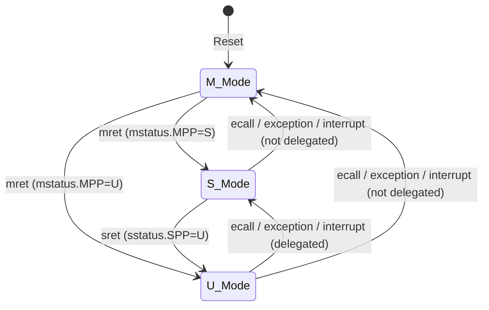

# Microarchitecture Design Document

## Overview

| Parameter | Value |
|---|---|
| ISA | RV64GCZicsr_Zifencei (I+M+A+F+D+C) |
| Pipeline | 5-stage in-order single-issue (IF → ID → EX → MEM → WB) |
| Privilege Levels | M / S / U |
| Virtual Memory | Sv39 (39-bit VA, 56-bit PA, three-level page table) |
| Bus | AXI4-Full (Cache) + AXI4-Lite (Peripherals) |
| Cache | I-Cache 4KB + D-Cache 4KB (direct-mapped, upgradeable to set-associative) |
| Debug | JTAG Debug (reserved) |

---

## Pipeline Timing

```
Cycle:    1     2     3     4     5     6     7
         ┌─────┬─────┬─────┬─────┬─────┐
Instr 1  │ IF  │ ID  │ EX  │ MEM │ WB  │
         └─────┼─────┼─────┼─────┼─────┼─────┐
Instr 2        │ IF  │ ID  │ EX  │ MEM │ WB  │
               └─────┼─────┼─────┼─────┼─────┼─────┐
Instr 3              │ IF  │ ID  │ EX  │ MEM │ WB  │
                     └─────┴─────┴─────┴─────┴─────┘
```

### Stage Functions

| Stage | Module | Description |
|---|---|---|
| **IF** | `if_stage.sv` | PC generation, iTLB virtual-to-physical translation, I-Cache read, instruction alignment, branch prediction interface |
| **ID** | `id_stage.sv` | Instruction decode (`decoder.sv`), register file read (`regfile.sv`), immediate extension, CSR read, control signal generation |
| **EX** | `ex_stage.sv` | ALU operations (`alu.sv`), branch resolution (`branch_unit.sv`), multiply/divide (`muldiv.sv`), FPU operations (`fpu.sv`), effective address calculation |
| **MEM** | `mem_stage.sv` | dTLB virtual-to-physical translation, D-Cache read/write, load data alignment/sign extension, exception detection |
| **WB** | `wb_stage.sv` | Register file writeback, CSR writeback, final exception/interrupt handling |

### Hazard Handling (`hazard_unit.sv`)

| Type | Strategy |
|---|---|
| RAW Data Hazard | EX→EX forwarding, MEM→EX forwarding |
| Load-use | Stall 1 cycle (insert bubble at IF/ID stage) |
| Control Hazard | Static not-taken prediction; branch resolved at EX stage, flush IF/ID on misprediction |
| Structural Hazard | Eliminated by separate I-Cache / D-Cache |
| FPU Long Latency | Stall EX stage until FPU result ready (or multi-cycle EX) |

---

## Privilege Level Architecture

### Mode Switching



### CSR Register List

#### M-Mode CSRs
| CSR | Address | Purpose |
|---|---|---|
| `mstatus` | 0x300 | Global status (MIE, MPIE, MPP, FS, etc.) |
| `misa` | 0x301 | ISA capability descriptor (RV64IMAFD) |
| `medeleg` | 0x302 | Exception delegation to S-mode |
| `mideleg` | 0x303 | Interrupt delegation to S-mode |
| `mie` | 0x304 | Interrupt enable |
| `mtvec` | 0x305 | Trap vector base address |
| `mscratch` | 0x340 | M-mode scratch register |
| `mepc` | 0x341 | Exception PC |
| `mcause` | 0x342 | Trap cause |
| `mtval` | 0x343 | Trap value |
| `mip` | 0x344 | Interrupt pending |
| `mcycle` | 0xB00 | Cycle counter |
| `minstret` | 0xB02 | Retired instruction counter |
| `mvendorid` | 0xF11 | Vendor ID |
| `marchid` | 0xF12 | Architecture ID |
| `mimpid` | 0xF13 | Implementation ID |
| `mhartid` | 0xF14 | Hart ID |

#### S-Mode CSRs
| CSR | Address | Purpose |
|---|---|---|
| `sstatus` | 0x100 | S-mode status (subset of mstatus) |
| `sie` | 0x104 | S-mode interrupt enable |
| `stvec` | 0x105 | S-mode trap vector |
| `sscratch` | 0x140 | S-mode scratch register |
| `sepc` | 0x141 | S-mode exception PC |
| `scause` | 0x142 | S-mode trap cause |
| `stval` | 0x143 | S-mode trap value |
| `sip` | 0x144 | S-mode interrupt pending |
| `satp` | 0x180 | Page table base address + MODE (Sv39) |

---

## MMU (Sv39)

### Address Translation

```
63        39 38        30 29        21 20        12 11         0
┌──────────┬────────────┬────────────┬────────────┬────────────┐
│  (sign)  │  VPN[2]    │  VPN[1]    │  VPN[0]    │  Offset    │
│ 25 bits  │  9 bits    │  9 bits    │  9 bits    │  12 bits   │
└──────────┴────────────┴────────────┴────────────┴────────────┘
                    39-bit Virtual Address
```

- **iTLB** (IF stage): 16-entry fully associative, for instruction fetch virtual-to-physical translation
- **dTLB** (MEM stage): 16-entry fully associative, for Load/Store virtual-to-physical translation
- **PTW** (`ptw.sv`): On TLB miss, hardware walks the three-level page table, reading page table entries via D-Cache
- **sfence.vma**: Flush TLB (all entries or selective by ASID/VPN)

### Module Organization

```
mmu/
├── mmu_top.sv      ← Top-level: arbitrates iTLB/dTLB PTW requests
├── tlb.sv          ← Parameterized TLB: ENTRIES, ASSOC, ASID support
└── ptw.sv          ← Page Table Walker: three-level lookup state machine
```

---

## FPU Architecture (F+D Extensions)

### Module Organization

```
rtl/core/fpu/
├── fpu_top.sv          ← FPU top-level (dispatch + result selection)
├── fp_regfile.sv       ← Floating-point register file f0-f31 (64-bit)
├── fp_add.sv           ← Addition/subtraction unit
├── fp_mul.sv           ← Multiplication unit
├── fp_div_sqrt.sv      ← Division/square root (multi-cycle)
├── fp_fma.sv           ← Fused multiply-add (optional, high performance)
├── fp_conv.sv          ← Format conversion (int↔fp, f32↔f64)
├── fp_cmp.sv           ← Compare/classify (FEQ/FLT/FLE/FCLASS)
└── include/
    └── fp_pkg.sv       ← Floating-point types, rounding modes, exception flags
```

> **Note**: FPU operations typically require multiple cycles (especially division/square root), requiring FPU long-latency stall handling in hazard_unit. CSRs `fcsr` / `frm` / `fflags` are implemented in `csr_unit.sv`.

---

## Cache Subsystem

See [memory_map.md](memory_map.md) for address mapping.

| Parameter | I-Cache | D-Cache |
|---|---|---|
| Capacity | 4 KB | 4 KB |
| Line Size | 64 B (8 × 64-bit) | 64 B |
| Associativity | Direct-mapped (initial) | Direct-mapped (initial) |
| Write Policy | N/A | Write-back + write-allocate |
| Refill Bus | AXI4-Full Burst | AXI4-Full Burst |

### Cache Line Calculation

- 4 KB / 64 B = 64 lines
- Tag = PA[55:12], Index = PA[11:6], Offset = PA[5:0]

---

## Bus Interconnect

```
┌────────────────┐     ┌────────────────┐
│   I-Cache      │     │   D-Cache      │
│  AXI4 Master   │     │  AXI4 Master   │
└───────┬────────┘     └───────┬────────┘
        │                      │
        └──────┐    ┌──────────┘
               ▼    ▼
        ┌──────────────┐
        │  AXI4 Arbiter │
        └──────┬───────┘
               ▼
        ┌──────────────┐
        │  AXI4 Xbar   │ ← Address decode
        └──┬───┬───┬───┘
           │   │   │
    ┌──────┘   │   └──────┐
    ▼          ▼          ▼
┌───────┐ ┌───────────┐ ┌─────────────────┐
│ SRAM  │ │AXI4→Lite  │ │ (Expandable     │
│  Ctrl │ │  Bridge   │ │      Slave)     │
└───────┘ └─────┬─────┘ └─────────────────┘
                │
        ┌───┬───┴───┬───┐
        ▼   ▼       ▼   ▼
     CLINT PLIC   UART GPIO
     (AXI4-Lite Slaves)
```
